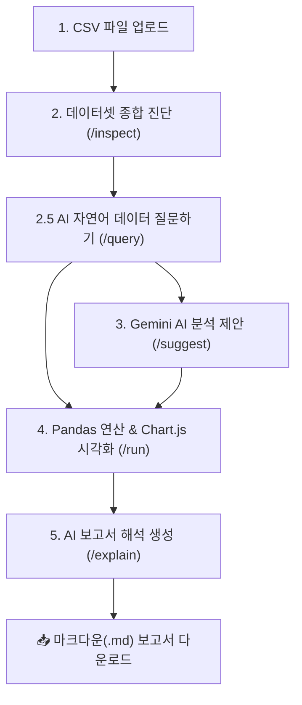

# 🤖 AI Data Insight Builder (Edu Edition)

> **Gemini 3.1 AI와 Pandas 수치 연산을 결합한 지능형 데이터 분석, 시각화 및 인사이트 보고서 자동 생성 웹 애플리케이션**  
> 🎓 **출처/참고**: 우동호 박사의 AI-Builder 2주차 강의자료


---

## 📌 주요 특징 (Key Features)

1. **⚡ 메모리 기반 실시간 데이터 진단 (1단계 & 2단계)**
   - 업로드된 CSV 파일은 서버 디스크에 저장되지 않으며 **서버 메모리에 단 1개의 데이터셋만 안전하게 보관**됩니다.
   - `utf-8-sig`, `cp949` 등 자동 인코딩 감지, 상단 주석 스킵, 결측치/중복행, 대륙·그룹 집계 행(World, OECD 등) 자동 진단.

2. **💬 AI 자연어 데이터 질문하기 & 지능형 라우팅 (2.5단계 - `/query`)**
   - *"2024년 기준 인터넷 이용률 상위 10개 국가와 한국의 위치"* 처럼 자연어로 자유롭게 질문 가능.
   - Gemini AI 라우터가 13가지 분석 도구 중 최적 도구와 파라미터를 자동 선정하여 정확한 Pandas 수치를 계산.
   - **대상 국가 강조 시각화**: 질문에 언급된 국가(예: 한국 13위: 97.9%)가 상위 10위권 바깥에 있더라도 **황금색(Gold) 강조 막대**로 차트에 자동 동적 포함.

3. **🤖 Gemini AI 도구 제안 카탈로그 (3단계 - `/suggest`)**
   - 데이터셋 진단 결과를 바탕으로 이 데이터에서 가장 유용하고 가치 있는 분석 도구를 3~5개 선별하여 추천 사유 및 주의사항과 함께 제안.

4. **📊 Pandas 수치 연산 & Chart.js 동적 시각화 (4단계 - `/run`)**
   - 사용자 지정 연도 변경, 집계 행 포함/제외 옵션 조작 시 실시간 재계산 및 Chart.js 차트 렌더링.
   - 제외된 행 수 및 상세 제외 사유(집계 행, 결측치 등)의 분석 투명성 제공.

5. **📄 규격화된 AI 인사이트 보고서 생성 & 마크다운 다운로드 (5단계 - `/explain`)**
   - **모드 A**: 수치 없이 파일 정보만으로 작성한 허술한 비교용 보고서.
   - **모드 B**: Pandas 계산 수치만을 엄격히 사용하여 작성한 7대 규격 정식 마크다운 보고서.
   - 자연어 질문 맥락을 보존하여 유저 질문 의도에 완벽히 부합하는 보고서 작성 및 `.md` 파일 다운로드 지원.

---

## 🏗️ 시스템 아키텍처 및 파이프라인 (Architecture)



---

## 🛠️ 13가지 파이썬 수치 연산 도구 카탈로그

| 도구명 (Tool Key) | 한국어 기능 설명 | 주요 차트 형태 |
| :--- | :--- | :--- |
| `reshape_wide_to_long` | 와이드 ↔ 롱 포맷 변환 (연도 열을 행으로 접기) | 테이블 미리보기 |
| `quality_report` | 데이터 품질 종합 보고서 (결측치·중복·유령열 진단) | 텍스트 메타데이터 |
| `year_coverage` | 연도별 데이터 충실도 & 권장 기준연도 판별 | 막대 차트 |
| `detect_aggregates` | 대륙·그룹·소득 집계 행 자동 감지 | 요약 태그 |
| `describe_numeric` | 수치 요약 통계 (평균·중앙값·최소·최대) | 요약 카드 |
| `trend_line` | 연도별 시계열 변화 추이 | 선 그래프 (Line) |
| `top_bottom_n` | 기준연도 상위 N개 vs 하위 N개 비교 (특정 대상 포함 가능) | 수평/수직 막대 (Bar) |
| `group_summary` | 대륙·그룹별 평균 요약 비교 | 막대 그래프 (Bar) |
| `change_rate` | 두 시점 간 성과 변화량·변화율 비교 | 막대 그래프 (Bar) |
| `distribution` | 수치 구간별 빈도 분포 상태 | 히스토그램 (Histogram) |
| `correlation_scatter` | 두 변수 간 피어슨 상관계수 & 연관성 분석 | 산점도 (Scatter) |
| `compare_one_vs_all` | 특정 나라(한국) vs 전체 평균·중앙값 대조 분석 | 막대 그래프 (Bar) |
| `custom_dynamic_query` | **유저 맞춤형 동적 연산** (기존 도구로 처리 불가능한 질문 폴백) | 동적 차트 (Dynamic) |

---

## 🚀 시작하기 (Getting Started)

### 1. 사전 요구사항 (Prerequisites)
- Python 3.10 이상
- Google Gemini API Key ([Google AI Studio](https://aistudio.google.com/)에서 발급)

### 2. 가상환경 생성 및 패키지 설치

```bash
# 1. 가상환경 생성 (.venv)
python -m venv .venv

# 2. 가상환경 활성화 (Windows PowerShell)
.\.venv\Scripts\Activate.ps1

# (Git Bash 사용자인 경우)
source .venv/Scripts/activate

# 3. 필수 패키지 설치
pip install -r requirements.txt
```

### 3. 환경 변수 설정 (`.env`)

프로젝트 루트 디렉토리에 `.env` 파일을 생성하거나 `.env.example`을 복사하여 Gemini API Key를 입력합니다.

```env
# Gemini API Key 설정
GEMINI_API_KEY=your_actual_gemini_api_key_here

# 사용할 Gemini 모델 (기본값: gemini-3.1-flash-lite)
GEMINI_MODEL=gemini-3.1-flash-lite

# Flask 디버그 모드
FLASK_DEBUG=true

# 업로드 파일 용량 제한 (MB)
MAX_UPLOAD_MB=10
```

### 4. 애플리케이션 실행

```bash
python app.py
```

서버가 실행되면 브라우저에서 `http://127.0.0.1:5000` 로 접속합니다.

---

## 🌐 샘플 데이터셋 다운로드 및 배치 안내 (Sample Dataset Guide)

본 프로젝트의 시연 및 테스트용 공식 추천 데이터셋은 **세계은행(World Bank)의 전 세계 인구 대비 인터넷 이용률 지표**입니다.

1. **지표 공식 다운로드 페이지 접속**:
   - 🔗 [World Bank Indicator - Individuals using the Internet (% of population)](https://data.worldbank.org/indicator/IT.NET.USER.ZS)
2. **CSV 파일 다운로드**:
   - 페이지 우측 상단 `Download` 메뉴에서 **`CSV`** 버튼을 클릭하여 ZIP 압축파일(`API_IT.NET.USER.ZS_DS2_en_csv_v2_...zip`)을 다운로드합니다.
3. **`data/` 폴더에 압축 해제 및 파일 배치**:
   - 다운로드한 ZIP 파일의 압축을 해제한 후, 메인 CSV 파일(`API_IT.NET.USER.ZS_DS2_en_csv_v2_...csv`)을 프로젝트 루트의 `data/` 디렉토리에 배치합니다.
   ```text
   data-insight-builder/
   └── data/
       └── API_IT.NET.USER.ZS_DS2_en_csv_v2_33086/
           ├── API_IT.NET.USER.ZS_DS2_en_csv_v2_33086.csv  <-- (1단계 웹 UI에 업로드할 대상 파일)
           ├── Metadata_Country_...csv
           └── Metadata_Indicator_...csv
   ```
4. **웹 UI에서 테스트 실행**:
   - 웹 서버(`http://127.0.0.1:5000`) 접속 후 1단계 파일 업로드 상자에 해당 CSV 파일을 드래그 앤 드롭하거나 선택하면 진단 및 분석이 시작됩니다.

---

## 📂 프로젝트 구조 (Project Structure)

```text
data-insight-builder/
├── app.py                 # Flask 메인 서버 & API 라우트 (/inspect, /suggest, /run, /query, /explain)
├── tools.py               # 13가지 Pandas 수치 연산 및 차트 데이터 생성 엔진
├── requirements.txt       # Python 패키지 의존성 목록
├── .env.example           # 환경 변수 템플릿
├── templates/
│   └── index.html         # 메인 웹 UI 템플릿 (1~5단계 컴포넌트)
└── static/
    ├── app.js             # 프론트엔드 비동기 연동, Chart.js 렌더링, 콘솔 로거
    └── style.css          # 다크 모드 & 글래스모피즘 디자인 시스템 스타일시트
```

---

## 🔒 데이터 보안 및 개인정보 보호 (Privacy & Security)

- **서버 디스크 저장 안 함**: 사용자가 업로드한 CSV 파일은 서버 디스크에 파일 형태로 생성되거나 저장되지 않으며, **서버 메모리(RAM)의 `CURRENT_DATASET` 변수에만 1개의 데이터셋만 보관**됩니다.
- **새 파일 업로드 / 서버 재시작 시 자동 소멸**: 새로운 CSV를 올려 진단하거나 서버를 재시작하면 이전 데이터는 완전히 삭제됩니다.
- **프론트엔드 콘솔 마스킹**: 웹 브라우저 디버그 콘솔 로그에는 CSV 파일 원본 데이터나 API Key 등의 민감 정보가 일체 기록되지 않습니다.

---

## 📄 라이선스 및 출처 (License & Credit)

- **강의 출처**: 우동호 박사의 AI-Builder 2주차 강의자료
- **용도**: Edu Edition - Educational & Demonstration Purpose.
